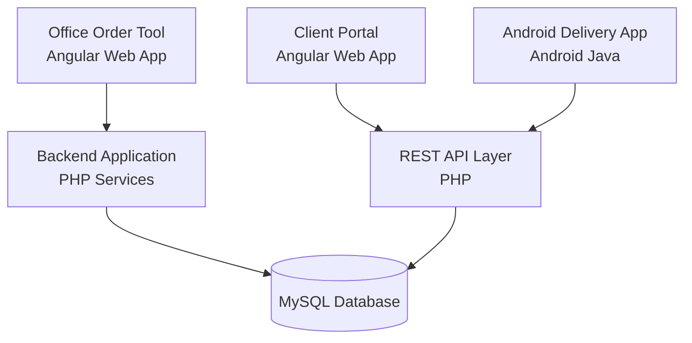
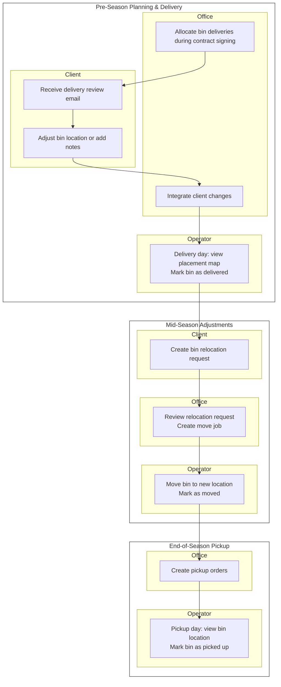

import ImagePreviewer from '../../components/ImagePreviewer.astro';

**Context**

At the start of each winter season, Monster Plowing coordinates a massive single-day effort to deliver salt buckets and bins to hundreds of clients across the GTA. Key challenges:

- For many employees, this is their first day in the field.
- Seasoned employees will still be unfamiliar with the properties they visit.
- Placement of deliveries on site is specific and coordinated.
- Mis-placed bins require costly second visits (each bin weighs 400+ lbs).
- Locked gates or other blockers can prevent delivery.
- All bins need to be picked up at the end of the season in another single-day effort.
- All bin deliveries are part of rental agreements; unrecovered bins are a financial loss.
---

**Problem**

As the company continued to grow each season, managing the specific placement of 400lbs bins of salt at an increasing number of client properties become cumbersome and time consuming. 

- Writing placement instructions in text fields alone was inefficient and not effective at communcating placement. 
- There was no communication layer where customers could confirm intended placement.
- When the bins needed to be picked up at the end of the season, the pickup location was not guaranteed to be accurate.
- Delivery outcomes were difficult to track.
- Requiring direct client intervention at the time of delivery was impossible under the single-day time constraint.
- Client's specific location requests from previous season were forgotten/lossed.
- Placement-focused ordering is a unique business requirement not represented in available software.

---

**Constraints**

The solution needed to support three different user types:

- **Office staff** planning deliveries
- **Clients** reviewing delivery placement
- **Field operators** completing deliveries

Additional requirements:

- Support both **web interfaces** and an **Android mobile app**
- **Client changes** to placement or notes must be reviewed by office staff (clients cannot alter original data)
- **Placement history** must be preserved across multiple seasons for recurring contracts
- Some clients **own their own bins**; the system must track these separately, make them available for refill orders, but exclude them from pickup events
---

**Solution**

I designed a **cross-platform delivery planning system** centered on **map-based placement** of products.

Key features:

- **Office staff** can place delivery markers directly on a site map for each bin
- **Coordinates and notes** are stored with the delivery order and shared across all systems
- **Clients** receive notifications with a link to their portal to:
  - Adjust placement or add notes
  - Waive (cancel) delivery
  - Order additional bins
  - Add a bin to their property map that they own.
- **Operators** can view each item’s placement and mark it as delivered or not
- **Mid-season adjustments**:
  - Clients can request additional bins, re-locations, or refills
  - Office users can review and approve requests
- **Multi-season contracts**:
  - When creating deliveries for returning clients, office users can view last year’s bin locations and notes
---

**System Architecture**

**Delivery Workflow**

---

**Office Order Tool**
## Order Creation:
- When a snow removal contract is signed, the quoted scope of work site map is integrated into the sytem. 
- During signing finalization, office staff build the initial ice melter bin/bucket order included with the contract agreement. 
- The order tool allows them to place each bin/bucket on a specific location on the existing site map. 
- Placing the icons on the map assigns simple coordinates (in percentages of image width/height). 
- Once the order is created, coordinates are saved and the order items are marked as pending.
- The office user can view previous seasons locations and notes of all delivered items if, for example, the  contract is a renewal from a previous season.

    

        <ImagePreviewer image={{src:'/assets/office_order.jpg', thumbSrc:'/assets/office_order.jpg', name:'office order page', width:400, height:400 }} />
        <small>office order creator: addresses names redacted</small>
    

---

**Client Portal Order Tool**

## Order Review:
On the client portal order page, clients can: 

- change the placement location of the pending order item
- change notes regarding each item
- order additional items
- waive (delete) delivery
- add bins they own to the site map and request refills of them.

Any changes requested are saved to a copy of the order for office review.

    

        <ImagePreviewer image={{src:'/assets/client_one.jpg', thumbSrc:'/assets/client_one.jpg', name:'client order page', width:400, height:400 }} />
        <small>client order tool: addresses names redacted</small>
    

---

---

**Office Review**

Office can accept/cancel pending changes.

    

        <ImagePreviewer image={{src:'/assets/office_two.jpg', thumbSrc:'/assets/office_two.jpg', name:'office reviewing changes', width:400, height:400 }} />
        <small>A snapshot of the same order tool: an order with pending client changes</small>
    

---

**Mobile Service App**

## Delivery Day:

Within the operator android application, user can

- view planned bin locations on the interactive site map tool
- confirm successful delivery
- make comments on the site map about delivery blockers, or use internal chat to notify dispatch.

    

        <ImagePreviewer image={{src:'/assets/tablet_one.jpg', thumbSrc:'/assets/tablet_one.jpg', name:'tablet site map tool', width:400, height:400 }} />
        <small>a screen from the service app. addresses redacted</small>
    

Once the bin is marked as delivered, it becomes a permanant item in the sites' data. Both office staff, and clients can act on these items:

- requesting refills
- requesting they be moved
- requesting they be removed.

---

**Impact**

The system created a shared understanding of delivery instructions across all stakeholders.

Benefits included:

- clearer placement instructions for operators
- improved customer communication
- consistent delivery tracking
- dramatically reduced return visits
