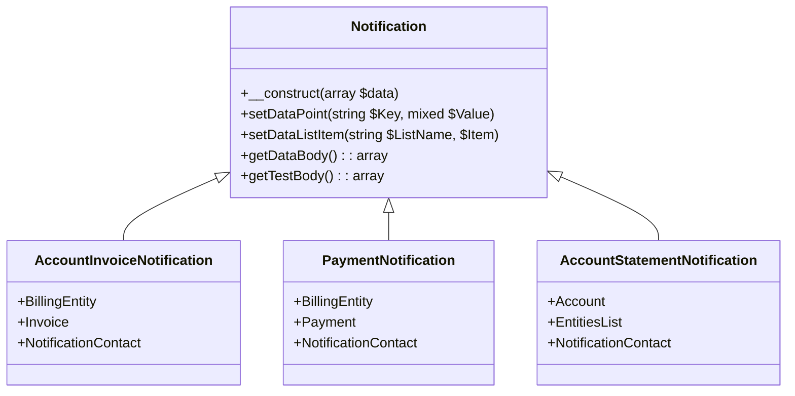
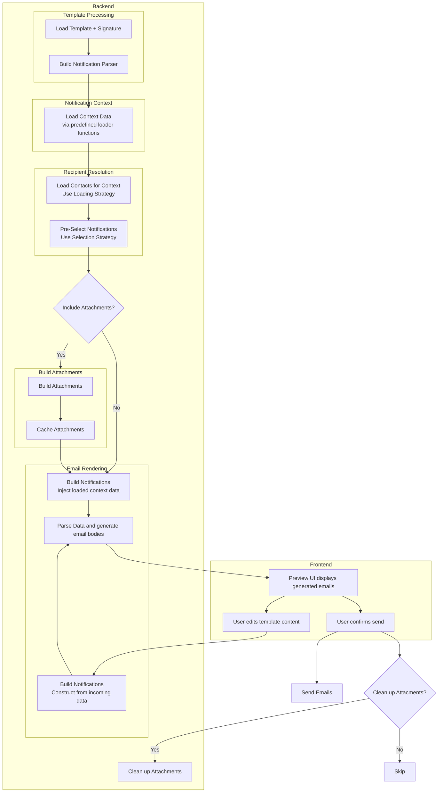

> **Impact**
>
> • Enabled staff to create dynamic customer communications  
> • Reduced developer involvement in operational messaging  
> • Standardized email templates across the organization  

---

## Context

Operations staff frequently needed to send customer notifications containing data from the operational system, such as billing information, invoice details or quote information. There was a high need for users to have the ability to build custom email templates without developer intervention.

---

## Problem

The existing approach created several issues:

- templates were hardcoded in application code
- staff could not create or modify templates independently
- developers became a bottleneck for operational communication
- email content often required repeated code updates

**Example Use Case**

The user wishes to select a list of quotes not yet signed by the client from a specific region and send a custom notification to all account owners for those quotes writing that their time to sign the quote is ending soon.

----

## Constraints

A key requirement was that every notification be sent as an individual email to a single recipient. This was so that pre-authorized links to the client dashboard could be generated for each recipient tied to their contact data in our system.

## Goals

The new system needed to:

- allow staff to edit email templates
- validate templates against a set of test data with the same shape and format as real data
- reliably load customer data
- center a group of notifications around a specific context 
- load notification recipients for each context based on rules
- pre-select recipients based on a different set of rules
- provide preview functionality before sending
- allow the user to edit templates before sending
- allow editing of a single notification, or all of them at once
- allow selecting more contacts or unselecting contacts for a particular context
- manage caching and clean up of attachments
- validate emails with the template engine on updates
- restrict data loading to pre-defined functionality
- templates could not access arbitrary database data
---

## Solution

- I utilized an existing templating engine called [Twig](https://twig.symfony.com/), and built an email templating system around existing business data, so users could craft custom emails around a few classes of notifications. 

- For example: one of these classes, ```AccountInvoiceNotification``` fulfilled an obligation to provide data about:
     - an Invoice
     - the billing entity it belonged to
     - the account the entity belonged to
     - and the contact to whom the notification would be sent

- The architecture separated: 
    - template rendering
    - data loading 
    - and recipient resolution 
 into independent layers. 
 <br />This allowed the same templating system to be reused for automated system notifications, interactive staff-driven communications, and system level template management.
- Template variables were resolved through a controlled mapping between the template and backend data loaders.
- I created a standardized UI for reviewing generated notifications. It allowed for: 
    - Viewing the data body associated with each notification
    - Editing an individual notification, or applying changes to all notifications on the template level
    - Adding or removing notifications from the outgoing list
    - Applying a rule based selection strategy to the outgoing list
    - Changing signature bodies
    - Testing sending an notification
---

## Architecture

The system was structured around three core concepts:
<br />
- **Notification class** - defines the context of the notification, and which data will be present.
- **Template** — an email template, editable by users within the system.
- **Loading And Selection Strategies** — defines for which contacts a notification would be generated, and then for which of those generated would be pre-selected for sending.

<br />
Lets look at these three parts in more detail.
<br />
### Notification class 

Each notification class had the same basic structure:
1. Data models storing the context of the notification. e.g. Invoice
2. A test body - a data structure which can be generated without using real data and which can be used to edit and test notification modifications in the system settings.
3. A data body - the formatted data which will be accessed by the template engine

```php

class AccountInvoiceNotification extends Notification implements ToArray, JsonSerializable
{
    use NotificationDataDescription;
    private $BillingEntity;
    private $NotificationContact;
    private $Invoice;


    public function __construct($Incoming)
    {
        parent::__construct($Incoming);    
        $this->TestBody = [];   
        $this->TestBody[BillingEntity::getDataName()] = BillingEntity::getTestBody();
        $this->TestBody[NotificationContact::getDataName()] = NotificationContact::getTestBody();
        $this->TestBody[Invoice::getDataName()] = Invoice::getTestBody();
        
        if(isset($Incoming['Data'])){
            $IncomingData =  $Incoming['Data'];
            if(isset($IncomingData[BillingEntity::getDataName()])){
                $Entity = new BillingEntity($IncomingData[BillingEntity::getDataName()]);
                $this->setBillingEntity($Entity);
            }
            if(isset($IncomingData[NotificationContact::getDataName()])){
                $NotificationContact = new NotificationContact($IncomingData[NotificationContact::getDataName()]);
                $this->setNotificationContact($NotificationContact);
            }
            if(isset($IncomingData[Invoice::getDataName()])){
                $Invoice = new Invoice($IncomingData[Invoice::getDataName()]);
                $this->setInvoice($Invoice);
            }        
            
        }
    

    }

    ...
    ...
    //example setter
    public function setBillingEntity(BillingEntity $Entity){
        $this->BillingEntity = $Entity;
        //formatted data
        $this->setDataPoint(BillingEntity::getDataName(), $Entity->getDataBody());
    }

    ...
    ...


```
<small>The example ```AccountInvoiceNotification``` </small>
<br />
Each notification class could be constructed from scratch, building up the data as individual parts were loaded, or, from incoming data into the constructor. During construction, each property of the class was set as a data point and if that property wasn't a primitive, it was a class type which implented an interface:

```php
interface NotificationDataDescriptor
{         
	public static function getDataName();    
	public static function getTestBody();
    public function getDataBody();

}

```
<small>The interface any non-primitive data property should have </small>
<br />
This allowed new notification classes to be built into the system and have any data property which implemented the interface.
<br />
<blockquote class="border-l-4 border-neutral pl-4 italic">
    A single notification class could be used for multiple templates saved into the system. For example, the  ```AccountInvoiceNotification``` class described above could be used for an invoice creation notification, invoice edited notification, invoice coming due notification, and an invoice past due notification.
</blockquote>
<br />

<small>The diagram showing different notification classes and the relationship to a parent class </small>
<br />
<br />
### Email Template

An email template was saved into the database for each use case. At a basic level a template was comprised of:
- The notification class that would be loaded 
- The signature template which would be appended to the email body
- The loading and selection strategies for recipients
- the Html template for the template.
<br />
Example template html syntax:

<div class="bg-gray-50 p-4 rounded-lg overflow-x-auto border border-gray-200">
<pre class="whitespace-pre-wrap"><code>
Hello {'{{NotificationContact.FirstName}}'},

A new invoice {'{{Invoice.InvoiceNumber}}'} has been added to your account of {'{{Entity.EntityName}}'}.

This invoice is due {'{{Invoice.FormattedDueDate}}'}, please ensure to pay it promptly before such date.

Many thanks,

{'{{SigName}}'}
</code></pre>
</div>
<br />

**Editing Templates** 
In the internal web application, users could access a dedicated notification template settings page. The UI provided a WYSIWYG editor displaying the existing template alongside a static test data set generated by the Notification class. Users could edit the template, preview parsed output, view validation errors, and test sending emails before committing changes.
<br />

### Loading And Selection Strategies

Each notification class used two strategies:
- **Loading strategy** – determines which contacts receive notifications for a context
- **Selection strategy** – determines which of those notifications are pre-selected for sending
<br />
For automated scenarios (e.g., cron jobs), loading and selection are identical—all notifications are sent
For interactive scenarios, users review generated emails and may adjust recipients
<br />
Strategies are typically role-based; e.g., the invoice notification:
- Loads all billing contacts for an account (those with adequate permissions)
- Pre-selects only contacts who opted in for billing alerts
<br />
Users can add or remove recipients prior to sending to meet operational requirements
<br />

## Generating, Previewing, Sending Notifications
Each notification class had its own designated backend route, responsible for loading the correct data context. Other than that the code for generating, previewing, and sending notifications followed the same pattern:

<div class="zoomable-diagram" style="width:100%; overflow:hidden; border:1px solid #ddd;">

</div>
<small>An example generate, preview, and send flow.</small>
<br />

<blockquote class="border-l-4 border-neutral pl-4 italic">
   This diagram represents notification generation for a single context. But generation (retreiving context data, loading contacts, building attachments, and parsing) would be performed in bulk, in the most efficient way necessary for each notification class.
</blockquote>
<br />


---


## Impact

The templating system allowed operations staff to modify customer communications without developer involvement, drawing deep from real customer data. As well, once the system had been buikt, adding new template notification classes, or extending use cases was dramatically easier for developers. 

Benefits included:

- faster communication updates
- more flexible messaging
- reduced engineering workload
