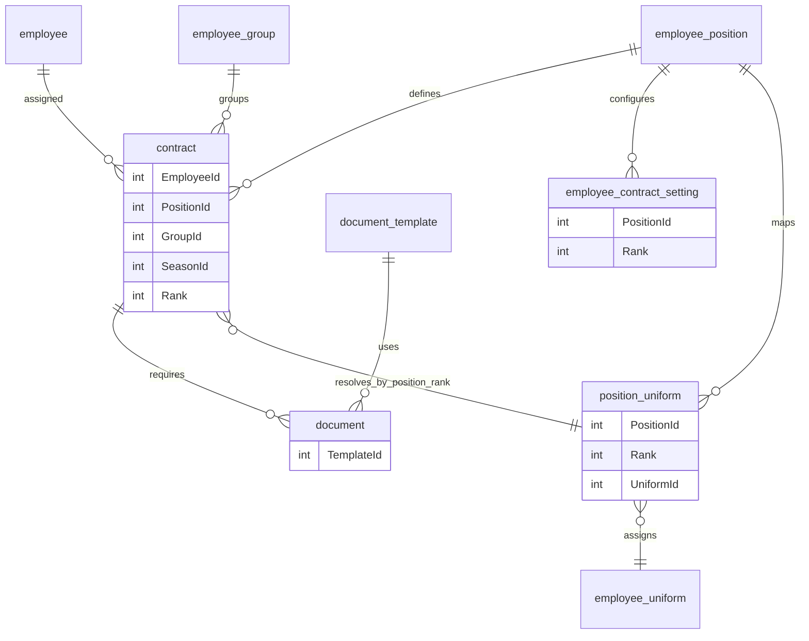

> **Impact**
>
> • Increased maintainability of code

> • Reduced manual onboarding work for office staff  

> • Enabled administrators to configure hiring workflows without developer intervention  

<br />
---

## Context

The company hires seasonal employees across multiple operational roles each year.  
Each role has different contract configurations, onboarding requirements, training materials, uniform assignments, and is associated with a specific performance leaderboard.
The company experiences consistent growth and frequently changes operational strategies.
<br />
---

## Problem

In spring of 2025, Management requested to change the set of positions that were available to the training and employee management system.

The required position changes were:
- Site Operator -> to be split into two seperate positions
- Team Supervisor -> to be removed.

And the rest of the positions were to remain untouched

<br />
My development team faced a problem:

- Employee positions were stored into the contract entity table as a string value
- Contract delivery, onboarding requirements, and training materials were all referencing hard-coded Position strings in code.
- Applications adjacent to the employee portal and the hiring system were also dependent and hard-coded.
- Adding any new role required major refactoring.
<br />
---

## Solution

My team and I took existing workflows that used position strings and refactored them to support a dynamic system managed entirely by administrators.
<br />
The new system needed to support:

- dynamically created employee positions
- a matrix of contract settings based on position X experience rank
- different onboarding requirements per positions
- different training modules per positions
- a simple uniform management system per positions X experience rank
- a system for arranging similar positions into groups to benefit UI 

<br />
### Core Architectural Shift

The refactor centered around treating employee positions as a first-class, database-driven entity:
- All systems now reference position_id instead of hard-coded enums or conditionals
- Business logic was moved from application code into data relationships and configuration tables
- System behavior is now determined by configuration rather than branching logic
- New positions can be introduced without modifying application code

<br />
### Major Refactors

**Move Positions To The Database**

1. Identified all conditional logic tied to position behavior and replaced it with database-driven configuration

    for example:
    - Managers do not require time tracking.
    - Blower operators do

    This became a column in the table: ```RequiresTimeClock```
2. We built UI for creation and managing of positions
3. Introduced a shared access layer for position data:

    - Centralized service for retrieving positions
    - In-memory caching to reduce repeated queries
    - Cache invalidation triggered on configuration updates

    This ensured:

    - Consistent data across the whole application
    - Immediate propagation of configuration changes
<br />
**Contract Configurations Refactor**

4. Contract logic was normalized into a configuration matrix:
    - Keyed by PositionId and Rank 
    - Included fields such as pay rate, job description, and guaranteed hours
    - UI introduced for managing configurations per position/experience level
    - Reused the same caching + invalidation pattern
    This allowed new positions to inherit or define contract behavior without code changes
<br />
**Onboarding Requirements**

5. Onboarding requirements were generalized into configurable workflows:

- Documents stored in shared storage and managed via UI
- Each document defined as:
    - Read-only or signable
    - Optionally auto-filled using employee/contract data
- Documents assigned by:
    - PositionId
    - Lifecycle stage (e.g. NEW, CONTRACT_SIGNED, HIRED)


The rest of the changes were fairly straightforward, and the full strategy is listed in the table below.
<br />
**All major components with solutions**
| System | Before | After |
|--------|--------------|----------|
| Employee Positions | Hard-coded into db and code | first-class database entity |
| Contract configurations | Conditional logic | Database accessible configuration matrix (PositionId, Rank)  |
| Onboarding | Hard-coded flows | Configurable, extendable by PositionId, Applicant Status |
| Training Modules | Position strings in db and code | Relational mapping |
| Uniforms | Fixed logic | Shared image repository, Relational mapping  |
| Employee Groups | Strings in code and db  | Relational mapping |

<br />
### Entity relationships after refactoring

The contract remained the central entity, but was normalized from a partially hard-coded structure into a relational context used to resolve all downstream behavior.



<small>The above model shows how an existing contract structure was normalized and extended to support dynamic configuration across the system.</small>
<br />
<br />


### Runtime Flow of Hiring and Onboarding

1. Position Creation (if requried)

- Hiring Manager creates a new Employee Position.
- Defines Contract Configurations for each experience level (Rank).
<br />

2. Applicant Onboarding

- Hiring Manager adds a new applicant, selecting Position and Rank.
- System applies default contract configuration using (position_id, rank)
- Hiring Manager can make manual edits if needed.
<br />

3. Invitation

- Hiring Manager sends an invite email to the applicant.
<br />

4. Applicant Contract Review

- Applicant registers in the portal.
- Presented with their contract document.
- Marks it as Read and Signs.
- System updates their Status → CONTRACT_SIGNED.
- System updates onboarding requirements using (position_id, status)
<br />

5. Contract Completion

- Hiring Manager reviews and signs the contract.
- System updates Status → HIRED.
- System updates onboarding requirements using (position_id, status)
<br />

6. Post-Hire Onboarding

- Employee continues completing onboarding documents for their Position and Status.
- Gains access to Training Modules and other assigned resources.
- Correct Uniform is allocated
<br />

## Outcome

The refactor removed hard-coded position logic across multiple systems and replaced it with a unified configuration model.
As a result:
- New positions can be introduced without code changes
- System behavior is consistent and centrally managed
- Dependent systems remain decoupled from business-specific logic
- Hiring process made simple and efficient for users.
